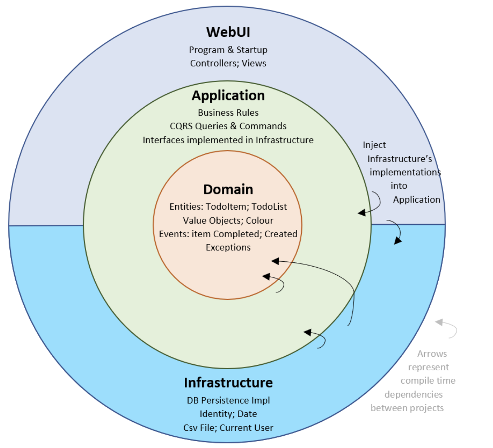

# MicroservicesProject

                MICROSERVICES
                     │
          Event-Driven Architecture
                     │
                  RabbitMQ
                MessageBroker
                     |
                Event-Driven
              Message Contracts
                     │
             ┌───────┴──────-┐┌───────┴──────────────────-┐
             │               │                            |
        Order Service   Payment Service                Restaurant Service
           Java 21        TypeScript - Node.js 22           
        Spring Boot        Node.js
             │               │
      Clean Architecture   Vertical Slice
             │               │
          Strategy          Factory
          Adapter           Builder
             │               │
             └────── Domain ─┘
                     │
                    DDD

Order Service = Domain orientation
Payment Service = Features/User case

Clean Architecture

